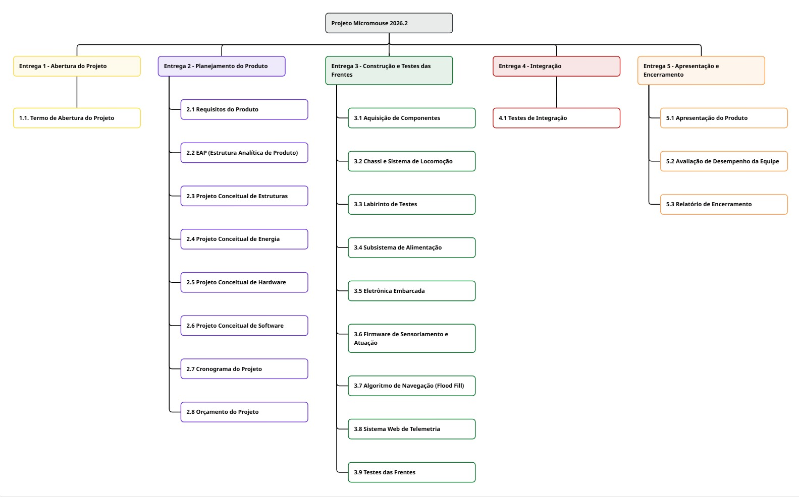

# Estrutura Analítica de Produto (EAP)
**Projeto Integrador 1 - Micromouse (2026.2)**

---

## 1. Visão Geral

Este documento apresenta a Estrutura Analítica do Produto (EAP) do projeto Micromouse. O diagrama abaixo representa a decomposição hierárquica de todo o escopo de trabalho necessário para construir e validar o robô e o sistema web de telemetria. 

A estrutura foi desenhada focando estritamente nas entregas e pacotes de trabalho, garantindo que toda a equipe técnica (Software, Eletrônica, Energia e Estruturas) possua uma visão clara de suas responsabilidades, sem adentrar no nível de atividades granulares.

## 2. Diagrama da EAP

*(O diagrama abaixo ilustra a divisão do escopo em 5 entregas principais e seus respectivos pacotes de trabalho)*

---

## 3. Níveis da Estrutura

A nossa EAP está dividida em 3 níveis hierárquicos:

* **Nível 1 (Projeto):** O escopo total do Projeto Micromouse 2026.2.
* **Nível 2 (Entregas):** Representa os grandes marcos de avaliação e consolidação do projeto, divididos em:
  * 1. Abertura do Projeto
  * 2. Planejamento do Produto
  * 3. Construção e Testes das Frentes
  * 4. Integração
  * 5. Apresentação e Encerramento
* **Nível 3 (Pacotes de Trabalho):** Representa as frentes de atuação específicas dentro de cada entrega, alocando blocos de trabalho para as equipes técnicas de Software, Eletrônica, Energia, Estruturas e pacotes de gestão Geral.