# Projeto Conceitual da Estrutura do Produto

## Dimensões

O chassi é dividido em três patamares de acrílico de 3 mm, ligados por espaçadores de nylon. As cotas principais de cada peça (extraídas do desenho técnico em CAD) são:

| Peça | Dimensões gerais (mm) | Espessura | Furos | Observações |
| :--- | :--- | :--- | :--- | :--- |
| Chassi – Primeiro Patamar | 100,00 x 44,00 (com recortes em 38,00/18,00) | 3,00 mm | Ø3,40 mm (M3) | Raios de canto R10,00 e R3,00 |
| Chassi – Patamar Intermediário | 100,00 x 22,00 | 3,00 mm | Ø3,40 mm (M3, +0,4 mm de tolerância) | Raios de canto R10,00 e R2,00; furos a 28,50 mm e 71,50 mm da borda |
| Chassi – Topo/Terceiro Patamar | 100,00 x 78,19 | 3,00 mm | Ø3,40 mm (M3) | Raios de canto R10,00 e R1,00 |
| Base do Suporte do Motor (PETG) | 80,00 x 33,00 | | Ø3,60 mm | Rebaixo de 36,1° para encaixe do motor N20 |
| Abraçadeira do Suporte do Motor (PETG) | 20,50 x 19,00 x 15,75 (altura) | 3,00 mm (parede) | Ø7,00 mm (assento do motor) e Ø3,40 mm com rebaixo (M3) | |
| Espaçadores de nylon | 4x 30 mm e 2x 15 mm | | | Distância entre patamares |
| Rodas motorizadas N20 | Ø34 mm | Pneu ~6,5 mm | Eixo em D de 3 mm | |

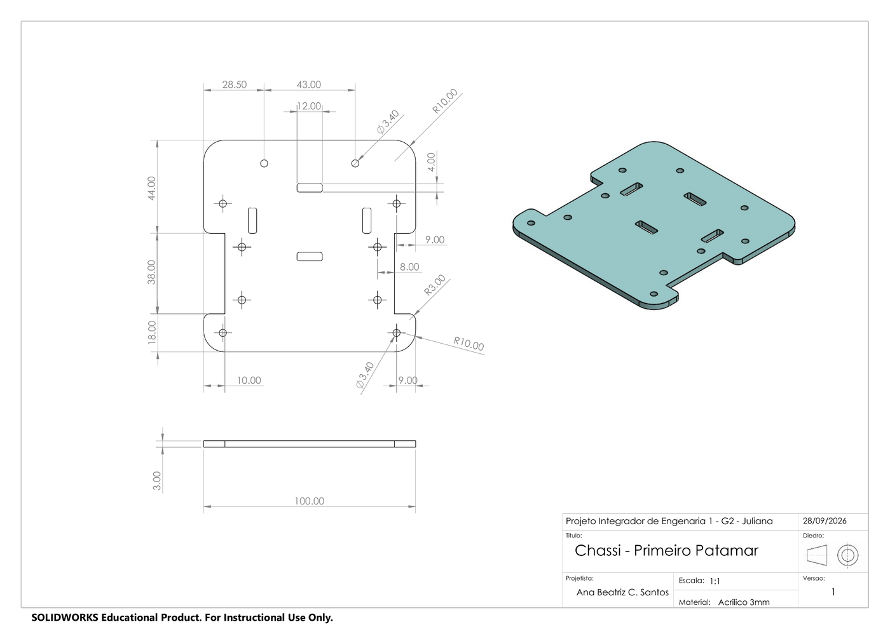

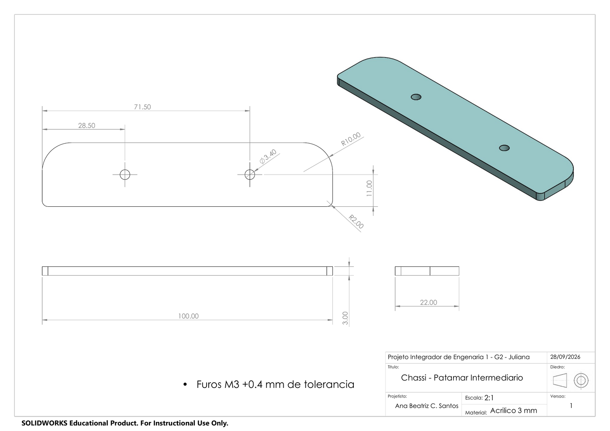

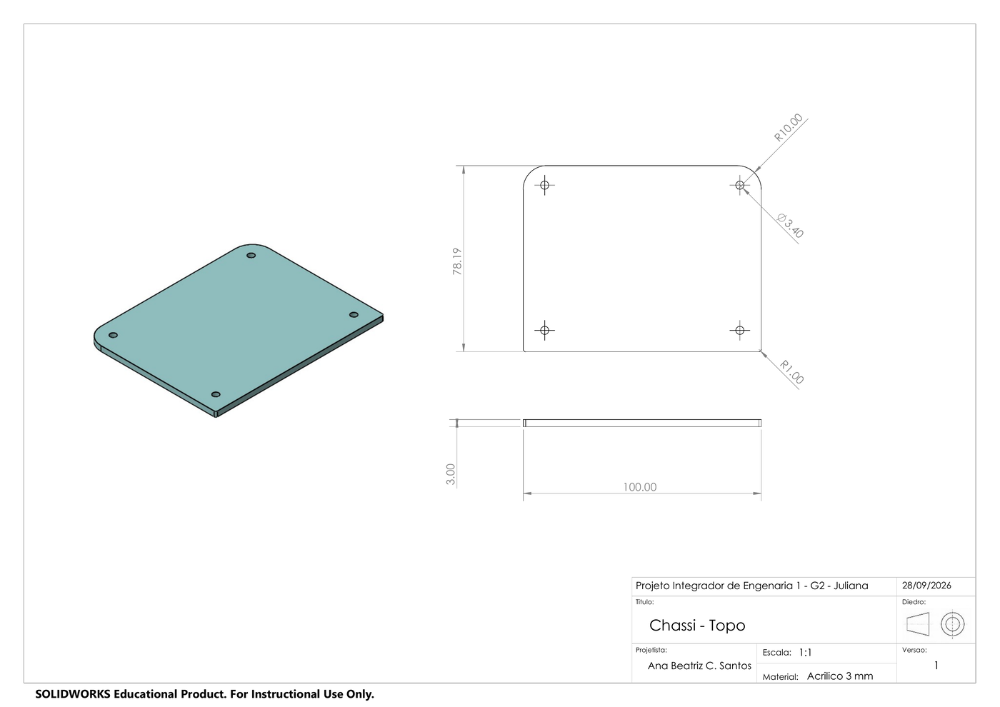

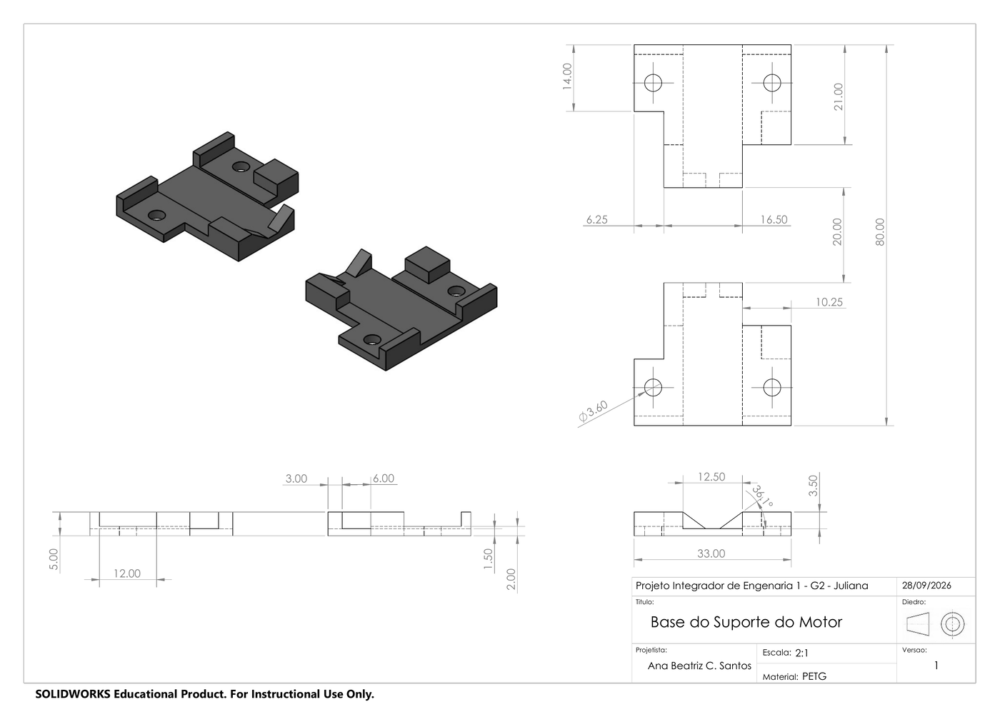

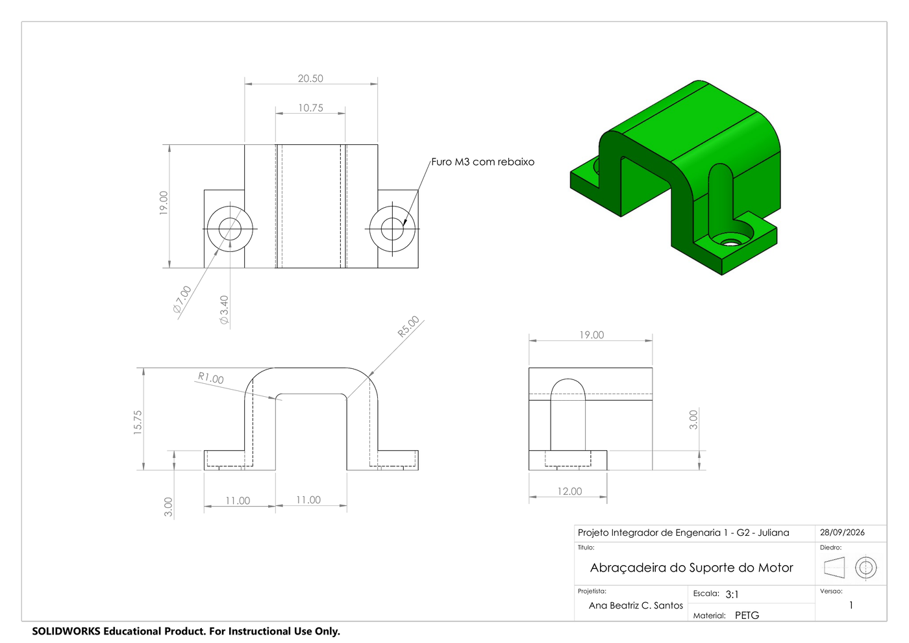

## Materiais Utilizados

| Componente/Parte | Material |
| :--- | :--- |
| Chassi (corpo/andares) | Acrílico |
| Encaixes e suportes menores (ex.: suportes dos motores N20) | Impressão 3D (PETG) |
| Espaçadores estruturais entre andares | Nylon |
| Fixação da placa (perfboard/ESP32) e do chassi | Parafusos M2/M3 |
| Base do labirinto de testes | MDF |
| Paredes do labirinto de testes | EVA 15 mm |
| Fixação/modularidade das paredes do labirinto | Ímãs + suportes em impressão 3D |
| Rodas motorizadas | N20, 34 mm |
| Roda auxiliar | Esfera deslizante (ball caster) |

## Partes Fundamentais

A estrutura do micromouse (EBOM V1) é composta pelas seguintes partes:

| Categoria | Item | Qtd. |
| :--- | :--- | :---: |
| Chassi | Primeiro Patamar (base) | 1 |
| Chassi | Patamar Intermediário | 1 |
| Chassi | Topo / Terceiro Patamar | 1 |
| Suporte/fixação | Base do Suporte do Motor | 1 |
| Suporte/fixação | Suporte do Motor (abraçadeira) | 2 |
| Suporte/fixação | Espaçador de nylon 30 mm | 4 |
| Suporte/fixação | Espaçador de nylon 15 mm | 2 |
| Atuadores | Motor N20 Mini Micro Metal Gear DC 3-6-12V v1 | 2 |
| Transmissão/rodas | Roda 34 mm N20 | 2 |
| Transmissão/rodas | Ball caster (esfera deslizante) | 2 |
| Energia | Bateria LiPo 2S | 1 |
| Eletrônica | ESP32 32D Kit V1 | 1 |
| Eletrônica | Motor Driver | 1 |
| Eletrônica | Perfboard 7x9 cm | 1 |
| Eletrônica | Perfboard 80 mm x 20 mm | 1 |
| Eletrônica | Barra Pino Fêmea | 4 |
| Eletrônica | Sensor VL53L0X | 3 |
| Eletrônica | INA226 | 1 |
| Eletrônica | MPU6050 v2 | 1 |

## Explicação do Desenho

O modelo CAD (SolidWorks) organiza o micromouse em três patamares de acrílico empilhados e ligados por espaçadores de nylon, conforme a EBOM (Engineering Bill of Materials) abaixo:

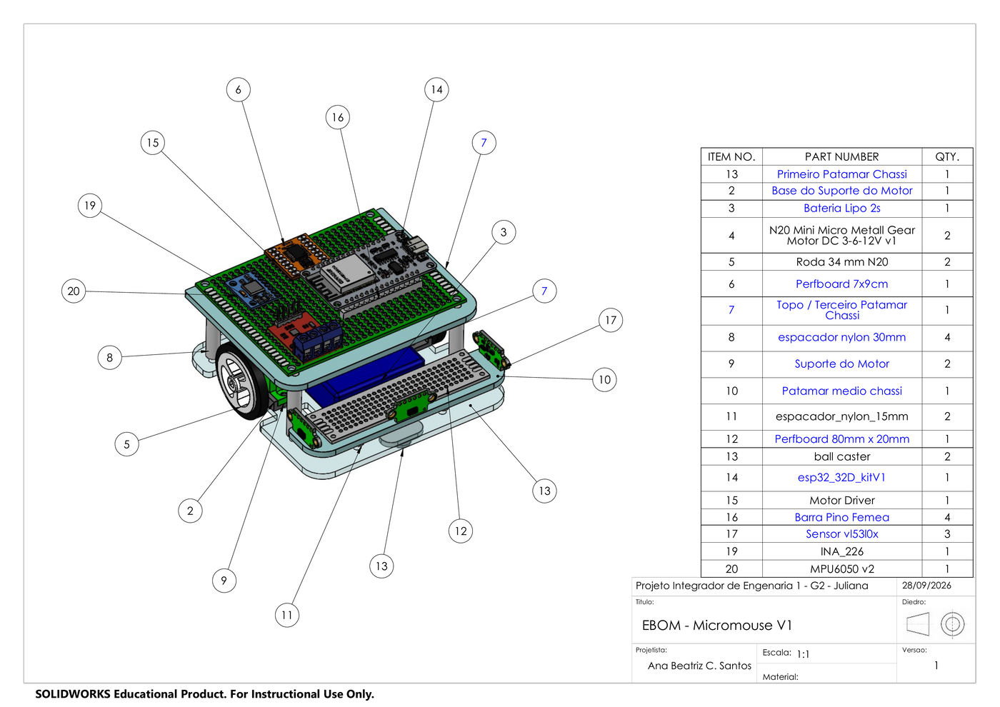

Na vista explodida, é possível identificar a distribuição de cada componente entre os patamares:

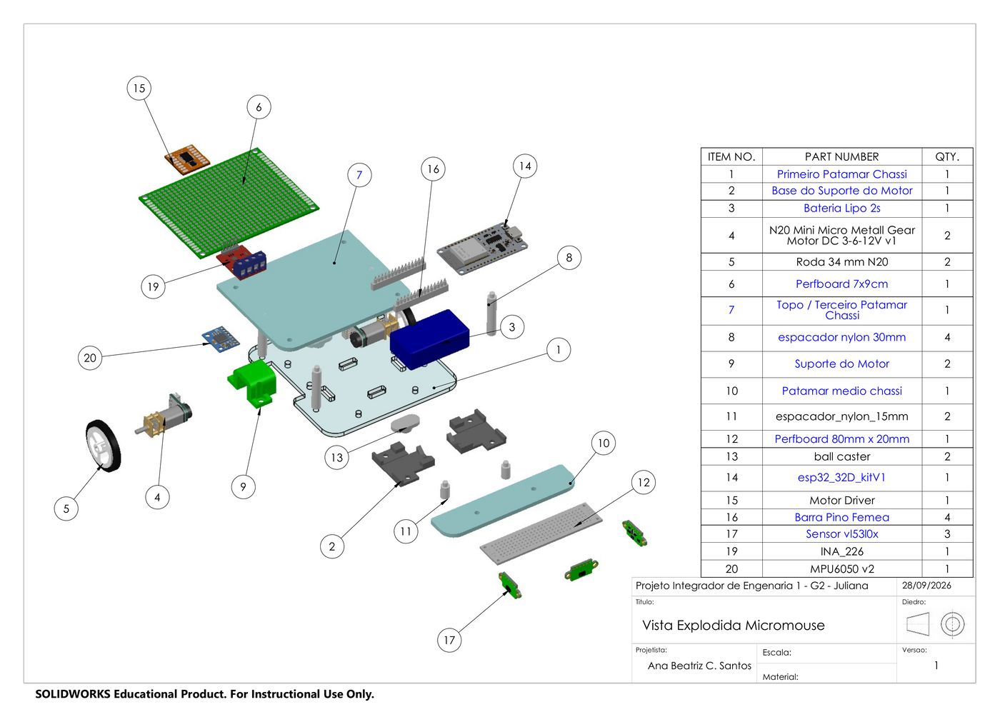

A vista completa (ortogonais) resume a função de cada andar:

- **Patamar Inferior** (Primeiro Patamar Chassi): aloja a bateria LiPo, os dois motores N20 com seus suportes (base + abraçadeira em PETG), as rodas 34 mm e a esfera deslizante (ball caster), centralizando o componente mais pesado (bateria) próximo ao eixo das rodas.
- **Patamar Intermediário**: destinado ao posicionamento dos três sensores VL53L0X, alinhados à altura das paredes do labirinto.
- **Patamar Superior** (Topo/Terceiro Patamar): recebe a montagem eletrônica principal , perfboard com o ESP32, driver de motor, INA226, MPU6050 e conectores , isolada eletricamente da estrutura pelos espaçadores de nylon.

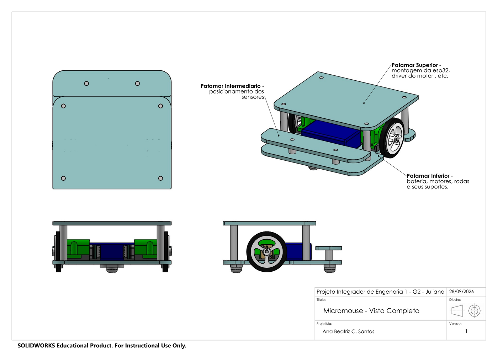

A vista detalhada da base do chassi mostra o posicionamento dos motores N20 (presos pela base e pela abraçadeira impressas em PETG), da bateria, das rodas e da esfera deslizante, todos apoiados sobre os espaçadores de 15 mm e 30 mm que definem a altura entre patamares:

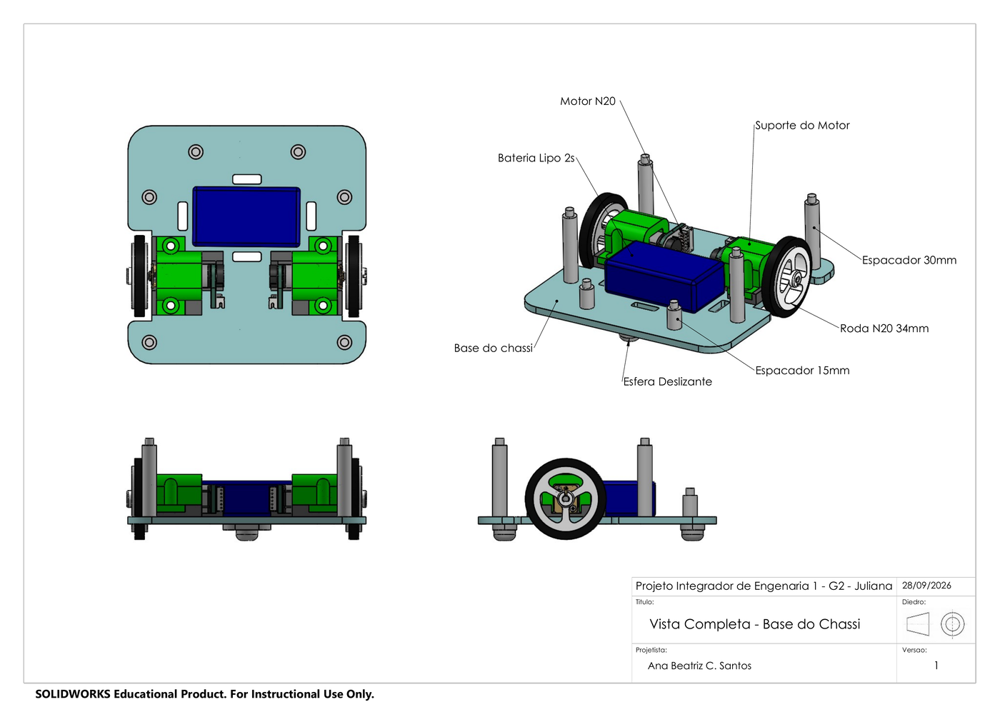

## Justificativa das Principais Decisões de Projeto

### 1. Seleção de Materiais

#### 1.1 Chassi em Acrílico

No desenvolvimento do micromouse, a escolha de materiais deve equilibrar rigidez mecânica, massa total, facilidade de fabricação e viabilidade financeira. Inicialmente, foram consideradas três alternativas principais para a confecção do chassi:

O MDF apresenta como principais vantagens o baixo custo de aquisição e a facilidade de corte. Em contrapartida, tem alta vulnerabilidade à umidade, fator que pode causar empenamentos e distorções nas dimensões da estrutura, comprometendo o alinhamento dos motores e dos sensores. Além disso, suas bordas cortadas tendem a desfiar e a perder precisão dimensional, o que dificulta furações e encaixes exatos, de forma que torna-se uma opção menos viável para atingir os requisitos do projeto.

Por sua vez, a impressão 3D oferece total liberdade geométrica para encaixes complexos, mas pode exigir tempo de fabricação elevado e apresentar menor rigidez planar por unidade de massa se comparada a chapas maciças. A baixa experiência dos membros do grupo com a manufatura aditiva também foi considerada no momento da escolha, de modo que optamos pelo uso desse material apenas em peças menores, como encaixes e suportes.

O acrílico, em contrapartida, apresenta alta rigidez estrutural, excelente estabilidade e um acabamento visual limpo. Embora possa ser quebradiço se submetido a impactos pontuais, a disponibilidade de chapas menores a preços acessíveis, bem como a possibilidade de utilizar corte a laser para contornar o risco de trincas com furações manuais, permitiu atender plenamente às exigências do projeto sem gerar gastos elevados. Assim, apesar de o MDF ser tradicionalmente visto como a opção mais barata, perderia em custo-benefício devido à necessidade de espessuras maiores para equiparar a rigidez de uma chapa de acrílico. Por essa razão, optou-se pelo uso desse material.

#### 1.2 Espaçadores de Nylon

A escolha de material para sustentação e espaçamento estrutural entre os andares do robô considerou alternativas como os componentes poliméricos moldados (nylon) frente a soluções de manufatura aditiva por impressão 3D (em ABS ou PETG). A principal desvantagem do uso de ABS/PETG é a propensão ao escoamento plástico sob pressão e a menor resistência mecânica a torções e cisalhamentos quando comparados a peças maciças. Os espaçadores de nylon, por outro lado, destacam-se por serem leves, de baixo custo, pelas propriedades de isolamento elétrico e uma certa flexibilidade mecânica que atua favoravelmente na absorção de vibrações e pequenos impactos operacionais. Portanto, a escolha do nylon entre os dois níveis da estrutura complementa o uso do acrílico no corpo principal do micromouse.

#### 1.3 Labirinto para Testes

Para a base do labirinto, optou-se pelo uso de MDF, que oferece estabilidade adequada para manter o alinhamento das malhas e um baixo custo de aquisição para áreas extensas de baixa espessura. Para as paredes, foi escolhido o EVA com 15 mm de espessura por ser firme o suficiente para manter a geometria vertical, não danificar a estrutura do robô em caso de colisões durante os testes e pela facilidade de cortar e manusear. Destaca-se ainda que a espessura do EVA excede em 3 mm a especificação padrão para as paredes da avaliação final, garantindo uma margem de segurança operacional. Por fim, para a fixação e modularidade, utilizou-se uma combinação de ímãs e suportes fabricados por impressão 3D, que permitem a montagem rápida, alinhamentos precisos e a flexibilidade necessária para reconfigurar o layout do labirinto de forma prática e repetível.

### 2. Rodas: escolha de modelo e tamanho

#### 2.1 Seleção e Dimensionamento das Rodas Motorizadas (N20 de 34 mm)

Foram escolhidas as rodas N20 de 34 mm, com largura de pneu de aproximadamente 6,5 mm, massa unitária de cerca de 5 g e eixo em D de 3 mm. Entre as principais características que justificam sua adoção está o dimensionamento do diâmetro, que favorece a relação entre a velocidade linear e o torque efetivo transmitido ao solo. Nesse sentido, rodas menores (em torno de 25mm) têm exigências de torque menores, mas limitam a velocidade nas retas, enquanto diâmetros maiores (acima de 40mm) exigem mais torque do motor N20 e aumentam o centro de massa, tornando o robô menos estável em curvas fechadas. O tamanho de 34 mm garante um equilíbrio adequado para respostas rápidas de aceleração e frenagem. Além disso, a largura das rodas escolhidas proporciona uma área de contato otimizada com a superfície da pista, garantindo tração suficiente para o deslocamento na superfície lisa do labirinto.

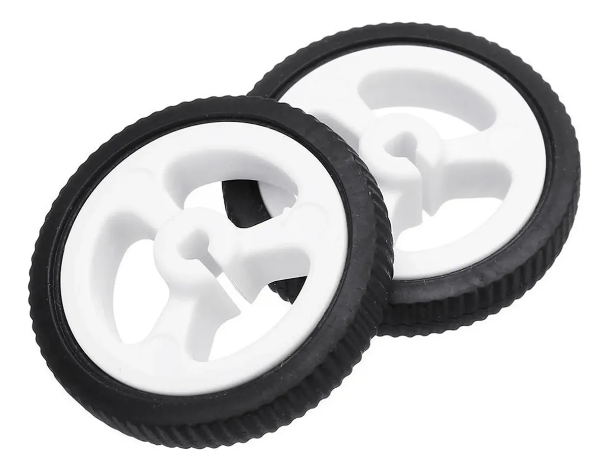

#### 2.2 Seleção das Rodas Auxiliares (Ball Caster vs. Caster Wheel)

Optou-se pelo uso da esfera deslizante (ball caster) para garantir estabilidade mecânica ao robô sem interferir na dinâmica de rotação e nos algoritmos de navegação, assegurando que o ponto de contato com o solo seja pontual e previsível. Ela consiste em uma esfera apoiada em uma cavidade de baixo atrito e sua principal vantagem é a capacidade de mudar instantaneamente de direção de rolagem sem nenhum atraso mecânico ou necessidade de esterçamento. Embora as rodas do tipo caster wheel sejam eficientes em suportar cargas distribuídas, elas possuem um braço de alavanca (offset) em relação ao seu eixo vertical de rotação. Esse deslocamento exige um raio de giro físico para que a rodinha se alinhe na direção do movimento, o que gera atrito indesejado e imprecisão significativa em manobras rápidas e mudanças bruscas de direção típicas de um Micromouse. A altura da esfera deslizante será ajustada com espaçadores para coincidir com a altura do eixo das rodas motorizadas, mantendo o chassi nivelado e os sensores paralelos ao piso.

| Ball Caster | Caster Wheel |
| :---: | :---: |
| 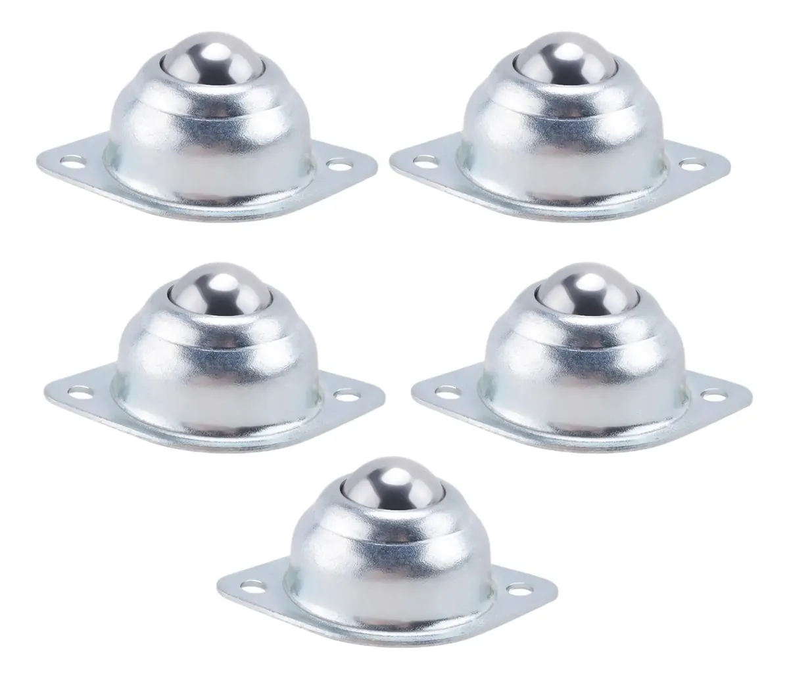 | 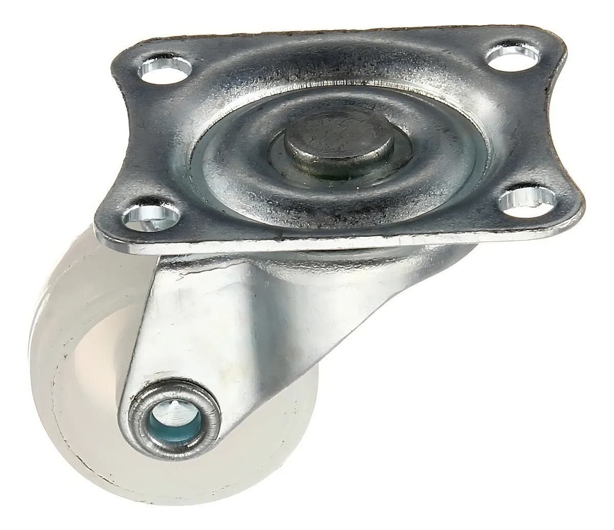 |

### 3. Montagem e Fixação dos Componentes

O acoplamento dos micro-motores N20 ao chassi será feito com suportes moldados por impressão 3D em PETG. Os suportes foram desenhados com perfis justos que abraçam o corpo metálico do motor, o que impede qualquer deslocamento axial ou rotação indesejada durante o deslocamento. Além disso, o PETG contribui com a absorção das vibrações geradas pela caixa de redução metálica dos motores N20, evitando que tais ruídos mecânicos sejam transmitidos para o chassi de acrílico e causem interferências ou leituras falsas nos sensores.

A placa de circuito (perfboard com o ESP32) será fixada ao andar superior do chassi por parafusos M2/M3 e espaçadores de nylon, que isolam eletricamente as trilhas da estrutura. A bateria LiPo, por ser o componente mais pesado do conjunto, será posicionada próxima ao eixo das rodas e presa com abraçadeira, de modo a manter o centro de massa baixo e centralizado. Os três sensores VL53L0X serão montados na frente e nas laterais, recuados em relação à borda do chassi e alinhados à altura das paredes, garantindo leituras dentro da faixa de operação dos sensores. Por fim, o chassi não possui quinas vivas nem parafusos salientes nas laterais, evitando danos ao labirinto.
