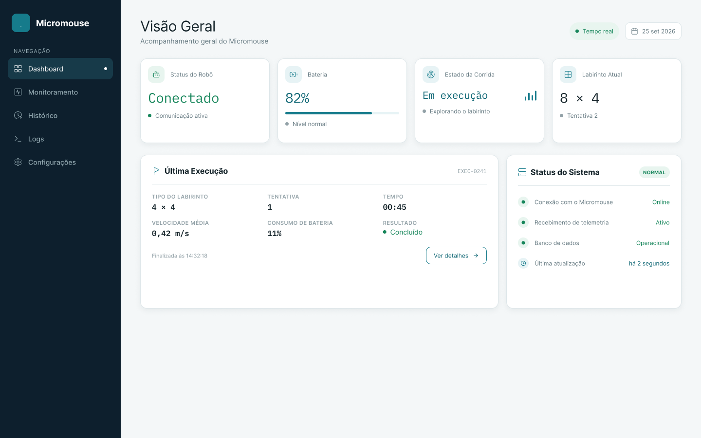
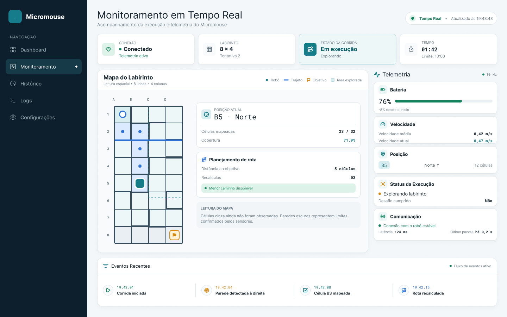
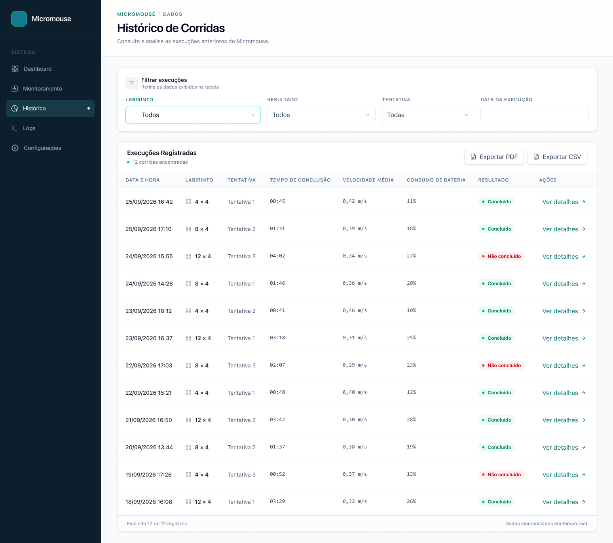
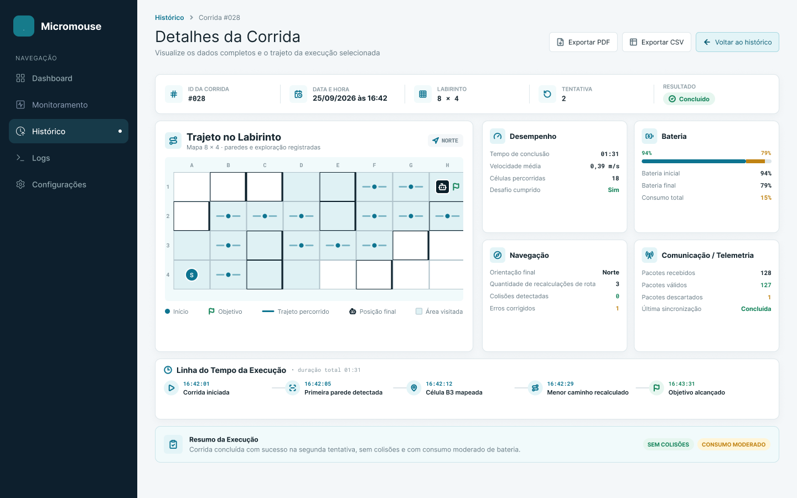
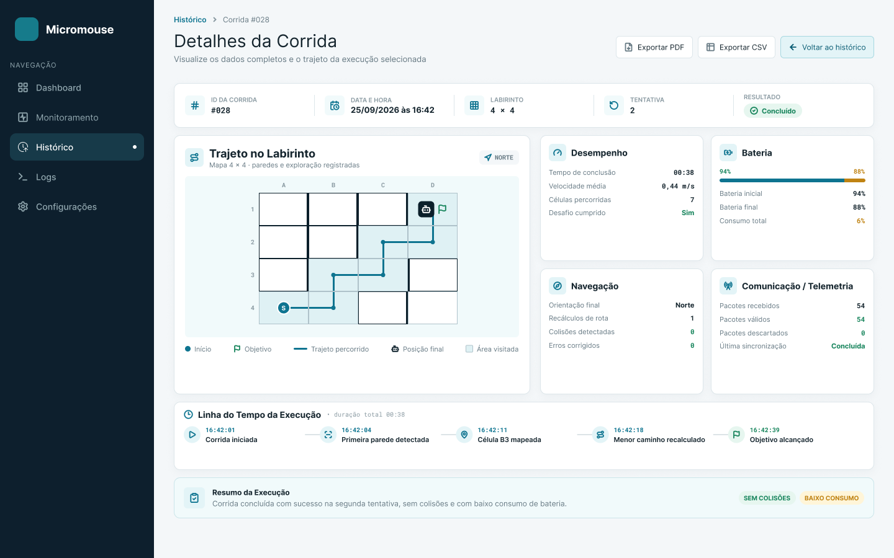
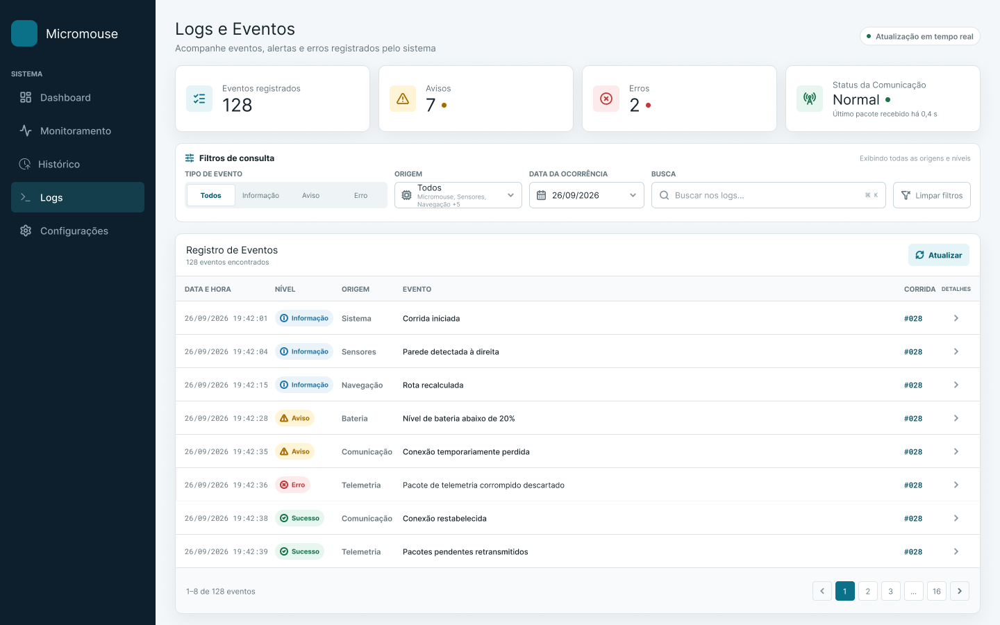
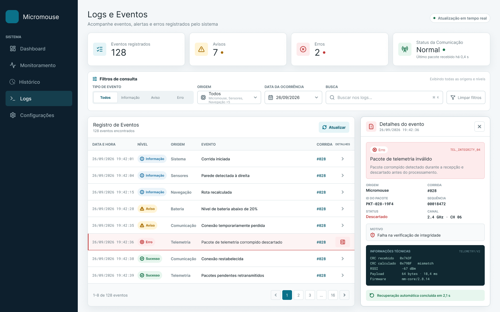

# 4.4.2 - Protótipos de Interface (Alta Fidelidade)

A camada de apresentação (Front-end) do sistema web de telemetria foi validada através da construção de protótipos de interface navegáveis projetados no Figma. 

As telas foram desenhadas para atender diretamente às Histórias de Usuário (HU) do projeto, cobrindo as exigências de acompanhamento do labirinto em tempo real, visualização de *logs* de depuração e exportação do histórico de corridas em formatos PDF/CSV.

🔗 **Acesso Interativo:** [Validar o protótipo navegável oficial no Figma](https://www.figma.com/design/I15f5HeygpZHgINJ57RxAS/Prot%25C3%25B3tipos-de-Interface--Mockups-?node-id=0-1&p=f&t=KgkugjsUx9gABX3d-0)

---

### 1. Visão Geral (Dashboard)
A tela principal exibe o status de conectividade do Micromouse, a porcentagem de bateria e um resumo da última execução, garantindo identificação rápida do estado do robô.

### 2. Monitoramento em Tempo Real
Esta interface cumpre o requisito de mapeamento autônomo, desenhando a matriz do labirinto célula a célula na tela enquanto o robô explora o ambiente físico, além de exibir a velocidade e a latência de transmissão.

### 3. Histórico e Detalhes das Corridas
Painel dedicado à consulta do banco de dados, permitindo visualizar a listagem geral das tentativas passadas e aprofundar nos detalhes do trajeto exato e consumo de bateria.

**Visão Geral do Histórico:**

**Visão de Detalhes Específicos:**

**Exemplo de Detalhamento (Malha 4x4):**

### 4. Logs e Eventos do Sistema
Área restrita à depuração e auditoria do sistema, listando o histórico de eventos, alertas de hardware e pacotes corrompidos interceptados pelo backend.

**Eventos Padrão:**

**Visualização de Alertas (Erros):**
