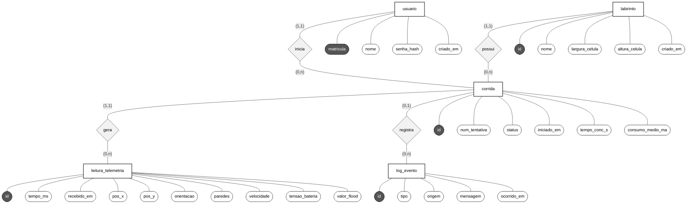
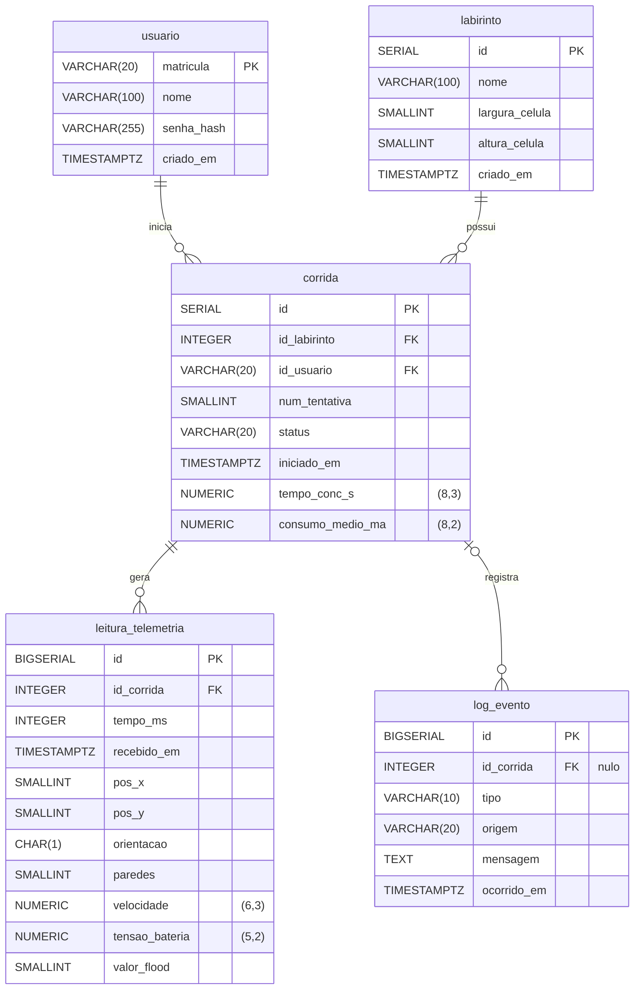

# 4.4.4 - Persistência de Dados (MER/DER)

## 1. Escolha do Banco de Dados
Foi adotado um banco de dados relacional, utilizando o SGBD PostgreSQL. Os dados do sistema têm uma estrutura fixa e relações bem definidas: um labirinto tem várias corridas, cada corrida é iniciada por um usuário e gera várias leituras de telemetria e vários eventos de log. Esse formato se encaixa naturalmente em tabelas ligadas por chaves estrangeiras.

| Critério | Relacional (PostgreSQL) | Não relacional (ex.: MongoDB) |
| :--- | :--- | :--- |
| **Estrutura dos dados** | Fixa e conhecida desde o projeto; cada leitura tem sempre os mesmos campos | Vantajoso quando a estrutura varia de um registro para outro, o que não é o caso |
| **Integridade (RNF07-S)** | Chaves estrangeiras, `NOT NULL`, `UNIQUE` e `CHECK` garantidos pelo próprio banco | A maior parte das regras teria de ser implementada e testada na aplicação |
| **Consultas (RF08-S, RF09-S, RF18-S)** | Filtros, junções e agregações (`COUNT`, `MIN`, `AVG`) diretamente em SQL | Agregações exigem pipelines específicos; junções entre coleções são limitadas |
| **Transações** | ACID: a finalização de uma corrida é gravada por completo ou não é gravada | Suporte existe, mas com mais restrições e configuração |
| **Volume de dados** | Da ordem de milhares de linhas por corrida, muito abaixo do limite de um único servidor | A escalabilidade horizontal, principal vantagem, não é necessária |

Entre os SGBDs relacionais, o PostgreSQL foi escolhido por ser gratuito, rodar localmente no notebook usado nos testes e na apresentação, oferecer o tipo `TIMESTAMPTZ` (data e hora com fuso horário) e aplicar de fato as restrições `CHECK`. A forma exata de conexão com o backend é definida no documento de Arquitetura (Visões 4+1).

---

## 2. Modelo Entidade-Relacionamento (MER)

### 2.1. Notação utilizada
O MER segue a notação de Chen, desenhada em Mermaid:
* Retângulos representam entidades; losangos representam relacionamentos.
* Elipses representam atributos; a elipse preenchida indica o identificador da entidade.
* Cada ligação traz a cardinalidade no formato (mínimo, máximo). O par escrito do lado de uma entidade indica com quantas instâncias dela uma instância da outra entidade se relaciona. Por exemplo, `(0,n)` do lado de `corrida`, no relacionamento possui, significa que um labirinto tem de zero a várias corridas.

### 2.2. Entidades
| Entidade | O que representa | Identificador | Requisitos |
| :--- | :--- | :--- | :--- |
| `usuario` | Operador que acessa o sistema web e inicia as corridas | `matricula` | RF21-S |
| `labirinto` | Configuração física de labirinto em que o robô corre (nome e dimensões em células) | `id` | RF08-S, RF09-S |
| `corrida` | Uma tentativa do robô em um labirinto, com seus dados finais (tempo, consumo, situação) | `id` | RF07-S, RF10-S |
| `leitura_telemetria` | Um pacote de telemetria válido enviado pelo robô durante a corrida | `id` | RF07-S, RF24-S, RF25-S, RNF06-S |
| `log_evento` | Um evento, aviso ou erro do firmware, do backend ou do frontend | `id` | RF20-S, RF24-S |

### 2.3. Relacionamentos e Cardinalidades
| Relacionamento | Cardinalidade | Leitura | Justificativa |
| :--- | :--- | :--- | :--- |
| `labirinto` - possui - `corrida` | `labirinto` (1,1) `corrida` (0,n) | Cada corrida acontece em exatamente um labirinto; um labirinto pode ter nenhuma ou várias corridas. | O labirinto é cadastrado antes da primeira corrida, então pode existir sem corridas. |
| `usuario` - inicia - `corrida` | `usuario` (1,1) `corrida` (0,n) | Cada corrida é iniciada por exatamente um usuário; um usuário pode ter iniciado nenhuma ou várias corridas. | Permite saber quem executou cada tentativa. A corrida é iniciada pelo sistema web, que exige login (RF21-S). |
| `corrida` - gera - `leitura_telemetria` | `corrida` (1,1) `leitura_telemetria` (0,n) | Cada leitura pertence a exatamente uma corrida; uma corrida pode ter nenhuma ou várias leituras. | A corrida é registrada antes de o robô enviar o primeiro pacote; se for abandonada antes disso (ex.: falha na calibração ou na largada), fica sem leituras. Quedas de conexão não causam esse caso, porque o robô guarda os dados localmente e os reenvia (RF25-S). |
| `corrida` - registra - `log_evento` | `corrida` (0,1) `log_evento` (0,n) | Cada evento pertence a no máximo uma corrida; uma corrida pode ter nenhum ou vários eventos. | Alguns eventos acontecem fora de uma corrida (inicialização, calibração, falha de login). |

### 2.4. Decisões de Modelagem
* **`log_evento` ligado a `corrida`, e não a `leitura_telemetria`:** Um pacote corrompido é descartado na validação (RF24-S) e nunca vira uma leitura, mas o descarte precisa ser registrado. Ligar o log à corrida permite registrar esse e outros eventos que não dependem de uma leitura.
* **`usuario` ligado a `corrida`, e não aos logs:** Com isso, cada tentativa guarda quem a executou, e o log de uma corrida chega ao usuário passando pela corrida, sem relacionamento redundante.
* **Tentativa como atributo de `corrida`:** O número da tentativa (`num_tentativa`) é um atributo de `corrida` com unicidade por labirinto, e não uma entidade separada. Isso basta para registrar e contar as tentativas (RF10-S) sem criar uma tabela extra.
* **Tempo relativo na telemetria:** O ESP32 não tem relógio de data e hora, apenas o tempo desde que foi ligado. Por isso cada leitura guarda `tempo_ms` (milissegundos desde o início da corrida) e o instante absoluto é obtido por `iniciado_em + tempo_ms`. Esse campo preserva a ordem real das leituras quando reenviadas após uma queda de conexão (RF25-S) e permite medir a latência (RNF06-S).
* **Paredes da célula em cada leitura:** As paredes detectadas na célula atual (RF01-S) são enviadas em cada pacote como uma máscara de 4 bits em direções absolutas (Norte = 1, Leste = 2, Sul = 4, Oeste = 8), somando os valores das direções com parede (ex.: paredes a Leste e Oeste = 2 + 8 = 10). Como cada direção é uma potência de 2, toda combinação gera um número único de 0 a 15, que cabe em um único campo. Com as paredes de cada leitura, o servidor monta o mapa do labirinto em tempo real e o histórico permite reconstruí-lo depois da corrida. A orientação não substitui esse campo, pois indica apenas para onde o robô está virado.
* **Valor de flood em cada leitura:** Guardar o valor de flood da célula atual permite reconstruir, depois da corrida, como o algoritmo Flood Fill tomou cada decisão de navegação.
* **Dados finais na própria `corrida`:** O tempo de conclusão e o consumo médio ficam em `corrida` para que as consultas de histórico (RF08-S, RF09-S) não precisem percorrer todas as leituras.
* **Senha armazenada como hash:** O banco guarda apenas o hash da senha (ex.: bcrypt), nunca a senha em texto puro.

---

## 3. Mapeamento do MER para o DER
O DER (modelo lógico) foi obtido a partir do MER aplicando as regras a seguir:

| Regra | Aplicação no modelo |
| :--- | :--- |
| Cada entidade vira uma tabela; o identificador vira a chave primária (PK) | `usuario` (PK matricula), `labirinto`, `corrida`, `leitura_telemetria` e `log_evento` (PK id) |
| Relacionamento 1:N vira uma chave estrangeira (FK) na tabela do lado N | `corrida.id_labirinto`, `corrida.id_usuario`, `leitura_telemetria.id_corrida`, `log_evento.id_corrida` |
| Participação mínima 1 do lado 1 gera FK obrigatória (`NOT NULL`) | `id_labirinto`, `id_usuario` e `leitura_telemetria.id_corrida` |
| Participação mínima 0 do lado 1 gera FK opcional (aceita nulo) | `log_evento.id_corrida` |
| A FK tem o mesmo tipo da PK que referencia | `id_usuario` é `VARCHAR(20)`, como `matricula`; as demais FKs são `INTEGER`, como os `id` `SERIAL` |

*(Os nomes das tabelas e colunas não usam acentos nem espaços, para evitar problemas em comandos SQL e no código do backend).*

---

## 4. Diagrama Entidade-Relacionamento (DER)
O modelo lógico com as tabelas, os tipos de dados, as chaves primárias (PK), as chaves estrangeiras (FK) e as cardinalidades. As cardinalidades usam a notação pé de galinha: `||` indica exatamente um (1,1), `|o` indica zero ou um (0,1) e `o{` indica zero ou vários (0,n). A precisão dos tipos `NUMERIC` aparece ao lado da coluna, porque o Mermaid não aceita vírgula no nome do tipo.

---

## 5. Restrições de Integridade
As regras abaixo são aplicadas pelo próprio banco de dados. Assim, mesmo que a aplicação tenha um erro, dados inconsistentes não são gravados (RNF07-S).

| Tabela | Restrição | Objetivo |
| :--- | :--- | :--- |
| Todas | `PRIMARY KEY` em `matricula` / `id` | Identificar cada registro de forma única |
| corrida | `UNIQUE (id_labirinto, num_tentativa)` | Impedir duas corridas com o mesmo número de tentativa no mesmo labirinto (RF10-S) |
| corrida | `CHECK (status IN ('em_andamento', 'concluida', 'abandonada'))` | Aceitar apenas situações válidas |
| corrida | `CHECK (status <> 'concluida' OR tempo_conc_s IS NOT NULL)` | Toda corrida concluída precisa ter o tempo de conclusão (RF07-S) |
| corrida | FK `id_labirinto` e `id_usuario` com `ON DELETE RESTRICT` | Impedir a exclusão de um labirinto ou usuário que já tenha histórico de corridas |
| leitura_telemetria | `UNIQUE (id_corrida, tempo_ms)` | Evitar leituras duplicadas quando o robô reenvia pacotes após uma queda de conexão (RF25-S, RNF12-S) |
| leitura_telemetria | FK `id_corrida` com `ON DELETE CASCADE` | Se uma corrida for excluída, as leituras dela também são, sem deixar registros órfãos |
| leitura_telemetria | `CHECK` de valores não negativos, `orientacao` em ('N','S','L','O') e `paredes` entre 0 e 15 | Rejeitar valores fisicamente impossíveis |
| log_evento | FK `id_corrida` com `ON DELETE SET NULL` | Se uma corrida for excluída, os logs são mantidos para depuração (RF20-S) |
| log_evento | `CHECK` de tipo e origem | Padronizar a gravidade e a parte do sistema que gerou o evento |

*(Também são criados índices em `corrida (id_labirinto)` e `log_evento (id_corrida)` para acelerar as consultas por labirinto e por corrida).*

---

## 6. Rastreabilidade entre requisitos e modelo de dados

| Requisito | Onde é atendido no modelo |
| :--- | :--- |
| **RF07-S** | Tabela `corrida` (`status`, `tempo_conc_s`, `consumo_medio_ma`) e `leitura_telemetria`; gravação final em transação |
| **RF08-S** | FK `corrida.id_labirinto` e índice |
| **RF09-S** | Junção labirinto-corrida com agregações |
| **RF10-S** | `corrida.num_tentativa` com `UNIQUE (id_labirinto, num_tentativa)` |
| **RF18-S** | Consultas servem de base para os relatórios em PDF ou CSV |
| **RF20-S** | Tabela `log_evento` (`tipo`, `origem`, `mensagem`, `ocorrido_em`) |
| **RF21-S** | Tabela `usuario` (`matricula` como login, `senha_hash`) e FK `corrida.id_usuario` |
| **RF24-S** | Validação antes do `INSERT`; pacotes descartados registrados em `log_evento`; restrições `CHECK` |
| **RF25-S / RNF12-S** | `leitura_telemetria.tempo_ms` com `UNIQUE (id_corrida, tempo_ms)` e `ON CONFLICT DO NOTHING` |
| **RNF06-S** | `leitura_telemetria.tempo_ms` e `recebido_em` |
| **RNF07-S** | PK, FK, `NOT NULL`, `UNIQUE`, `CHECK` e transação na finalização |

---

## 7. Dicionário de Dados
Descrição de cada coluna das tabelas do DER. A coluna "Nulo" indica se o campo pode ficar vazio.

### 7.1. Tabela `usuario`
Operadores autorizados a acessar o sistema web e iniciar corridas (RF21-S). *(A matrícula usa VARCHAR e não INTEGER porque é um código, preservando zeros à esquerda).*

| Coluna | Tipo | Nulo | Restrições | Descrição |
| :--- | :--- | :--- | :--- | :--- |
| `matricula` | `VARCHAR(20)` | Não | PK | Matrícula do usuário; é o identificador e o login |
| `nome` | `VARCHAR(100)` | Não | | Nome completo do usuário |
| `senha_hash` | `VARCHAR(255)` | Não | | Hash da senha (ex.: bcrypt); a senha nunca é salva em texto puro |
| `criado_em` | `TIMESTAMPTZ` | Não | DEFAULT now() | Data e hora do cadastro |

### 7.2. Tabela `labirinto`
Configurações de labirinto em que o robô pode correr.

| Coluna | Tipo | Nulo | Restrições | Descrição |
| :--- | :--- | :--- | :--- | :--- |
| `id` | `SERIAL` | Não | PK | Identificador único do labirinto |
| `nome` | `VARCHAR(100)` | Não | UNIQUE | Nome ou identificação do labirinto |
| `largura_celula` | `SMALLINT` | Não | CHECK (> 0) | Número de células no eixo X |
| `altura_celula` | `SMALLINT` | Não | CHECK (> 0) | Número de células no eixo Y |
| `criado_em` | `TIMESTAMPTZ` | Não | DEFAULT now() | Data e hora do cadastro |

### 7.3. Tabela `corrida`
Cada tentativa do robô em um labirinto, com os dados finais da corrida (RF07-S, RF10-S).

| Coluna | Tipo | Nulo | Restrições | Descrição |
| :--- | :--- | :--- | :--- | :--- |
| `id` | `SERIAL` | Não | PK | Identificador único da corrida |
| `id_labirinto` | `INTEGER` | Não | FK labirinto(id) ON DELETE RESTRICT | Labirinto em que a corrida aconteceu |
| `id_usuario` | `VARCHAR(20)` | Não | FK usuario(matricula) ON DELETE RESTRICT | Usuário que iniciou a corrida |
| `num_tentativa` | `SMALLINT` | Não | CHECK (> 0); UNIQUE (id_labirinto, num_tentativa) | Número sequencial da tentativa naquele labirinto |
| `status` | `VARCHAR(20)` | Não | CHECK (IN ('em_andamento', 'concluida', 'abandonada')); DEFAULT 'em_andamento' | Situação da corrida |
| `iniciado_em` | `TIMESTAMPTZ` | Não | DEFAULT now() | Data e hora do início da corrida; referência de `tempo_ms` |
| `tempo_conc_s` | `NUMERIC(8,3)` | Sim | CHECK (>= 0); obrigatório se status = 'concluida' | Tempo total até chegar ao objetivo, em segundos |
| `consumo_medio_ma` | `NUMERIC(8,2)` | Sim | CHECK (>= 0) | Corrente média consumida na corrida, em mA |

### 7.4. Tabela `leitura_telemetria`
Cada pacote de telemetria válido enviado pelo robô durante uma corrida (RF07-S, RF24-S, RF25-S, RNF06-S). *(O limite superior de `pos_x` e `pos_y` depende do tamanho do labirinto e é validado pelo backend antes de gravar - RF24-S).*

| Coluna | Tipo | Nulo | Restrições | Descrição |
| :--- | :--- | :--- | :--- | :--- |
| `id` | `BIGSERIAL` | Não | PK | Identificador único da leitura |
| `id_corrida` | `INTEGER` | Não | FK corrida(id) ON DELETE CASCADE | Corrida a que a leitura pertence |
| `tempo_ms` | `INTEGER` | Não | CHECK (>= 0); UNIQUE (id_corrida, tempo_ms) | Milissegundos desde o início da corrida, medidos no ESP32 |
| `recebido_em` | `TIMESTAMPTZ` | Não | DEFAULT now() | Data e hora de recepção no servidor (mede latência) |
| `pos_x` | `SMALLINT` | Não | CHECK (>= 0) | Coluna da célula atual (0 até `largura_celula` - 1) |
| `pos_y` | `SMALLINT` | Não | CHECK (>= 0) | Linha da célula atual (0 até `altura_celula` - 1) |
| `orientacao` | `CHAR(1)` | Não | CHECK (IN ('N','S','L','O')) | Direção para onde o robô está virado |
| `paredes` | `SMALLINT` | Não | CHECK (BETWEEN 0 AND 15) | Paredes da célula atual em máscara de bits: Norte = 1, Leste = 2, Sul = 4, Oeste = 8 (soma das direções com parede) |
| `velocidade` | `NUMERIC(6,3)` | Não | CHECK (>= 0) | Velocidade instantânea calculada (m/s) |
| `tensao_bateria` | `NUMERIC(5,2)` | Não | CHECK (>= 0) | Tensão da bateria no momento (V) |
| `valor_flood` | `SMALLINT` | Sim | CHECK (>= 0) | Valor de flood (distância) da célula atual |

### 7.5. Tabela `log_evento`
Eventos, avisos e erros de software e hardware para depuração (RF20-S), incluindo pacotes descartados.

| Coluna | Tipo | Nulo | Restrições | Descrição |
| :--- | :--- | :--- | :--- | :--- |
| `id` | `BIGSERIAL` | Não | PK | Identificador único do evento |
| `id_corrida` | `INTEGER` | Sim | FK corrida(id) ON DELETE SET NULL | Corrida associada; nulo se ocorreu fora de corrida |
| `tipo` | `VARCHAR(10)` | Não | CHECK (IN ('info', 'aviso', 'erro')) | Gravidade do evento |
| `origem` | `VARCHAR(20)` | Não | CHECK (IN ('firmware', 'backend', 'frontend')) | Parte do sistema que gerou o evento |
| `mensagem` | `TEXT` | Não | | Descrição do evento |
| `ocorrido_em` | `TIMESTAMPTZ` | Não | DEFAULT now() | Data e hora do evento |
