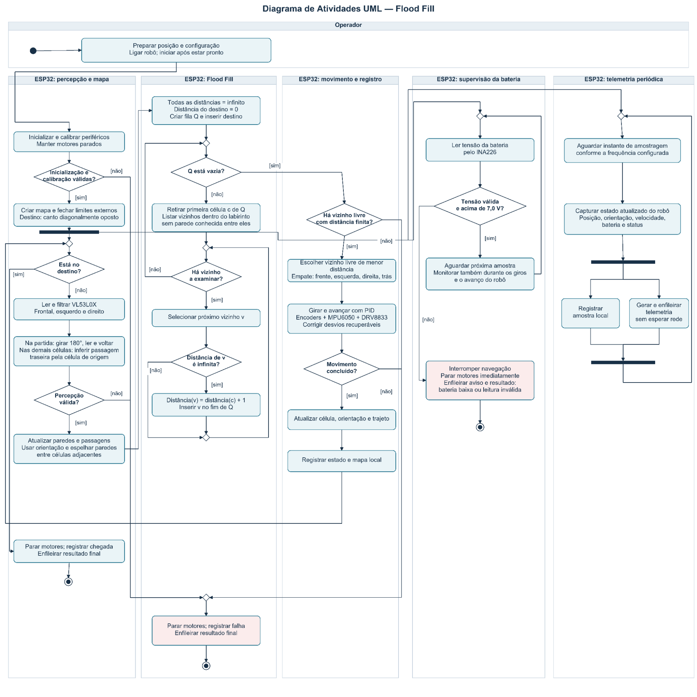

# 4.4.5 - Diagrama de Atividades UML do Flood Fill

**Descrição:** Mapeamento detalhado do fluxo de execução do algoritmo de preenchimento *Flood Fill* utilizando a notação de Diagrama de Atividades UML.

### 1. Dinâmica de Movimentação e Navegação
O diagrama detalha a navegação autônoma, onde o firmware propaga as distâncias e seleciona as passagens livres:
* **Sensores e Calibração:** O ESP32 inicializa os periféricos, realiza a leitura dos três sensores de distância VL53L0X e atualiza o mapa interno da malha.
* **Orientação:** Na partida, o robô realiza um giro de 180° para observação traseira e retorna à orientação inicial; nas células seguintes, a própria passagem de entrada fornece essa referência.
* **Controle Físico:** A locomoção é controlada em malha fechada via PID, integrando os encoders, o acelerômetro/giroscópio MPU6050 e a ponte H DRV8833 para aplicar a correção automática de desvios recuperáveis
### 2. Processamento Paralelo e Telemetria
As raias inferiores do diagrama representam responsabilidades lógicas simultâneas executadas pelo mesmo ESP32 (e não processadores distintos):
* **Concorrência:** As tarefas de navegação do labirinto, supervisão da bateria e produção periódica de telemetria ocorrem estritamente em paralelo.
* **Assincronismo:** A geração de pacotes não aguarda o fim do percurso de uma célula; as amostras são registradas e enfileiradas de forma independente (o recebimento e retransmissão pertencem ao serviço de rede).
* **Sincronização (Barras):** As barras horizontais pretas na notação UML indicam a bifurcação de atividades e a sincronização exata entre capturar o estado atual e enfileirá-lo.

### 3. Supervisão de Segurança (Bateria)
O fluxo prevê decisões críticas em tempo real para proteger o hardware:
* **Monitoramento:** O sensor INA226 fornece a leitura contínua da tensão do sistema.
* **Gatilho de Parada:** Foi estabelecido um limite de segurança de 7,0 V (garantindo uma margem técnica sobre o limite mínimo de 6,4 V estipulado pela equipe de Energia).
* **Ação de Falha:** Ao detectar uma tensão igual ou inferior a 7,0 V (ou uma leitura inválida), o fluxo interrompe a navegação imediatamente, trava os motores e envia o log de erro antes de encerrar as atividades.